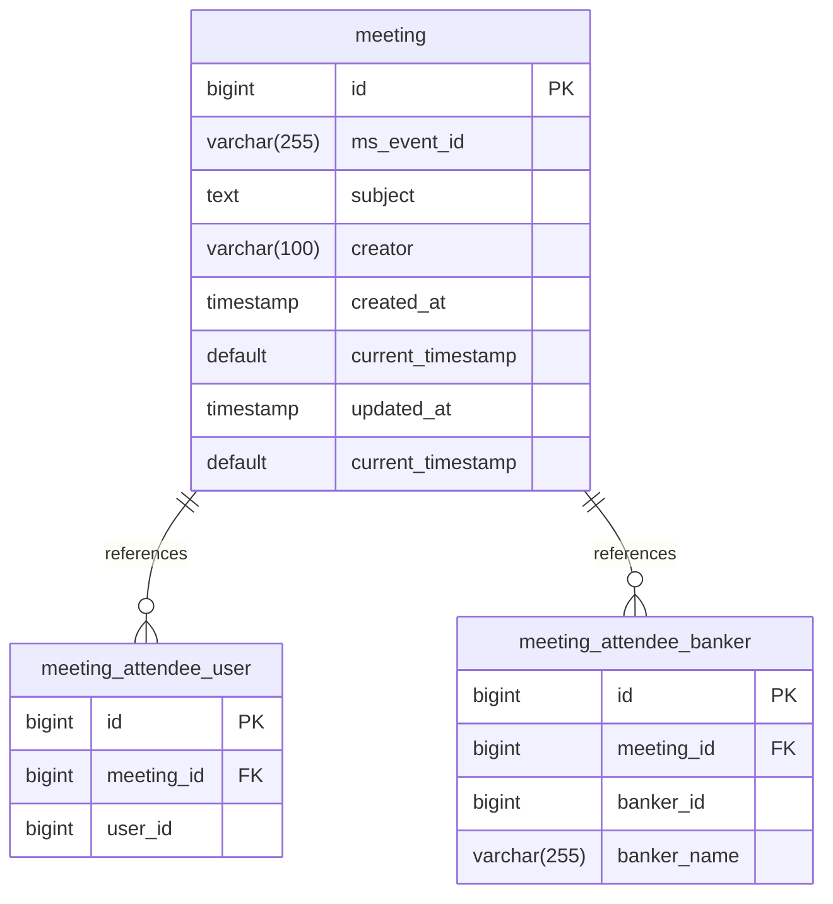

# DB設計

```mermaid
erDiagram

meeting {
    bigint id PK
    varchar(255) ms_event_id
    text subject
    varchar(100) creator
    timestamp created_at default current_timestamp
    timestamp updated_at default current_timestamp
}

meeting_attendee_user {
    bigint id PK
    bigint meeting_id FK
    bigint user_id
}

meeting_attendee_banker {
    bigint id PK
    bigint meeting_id FK
    bigint banker_id
    varchar(255) banker_name
}

meeting ||--o{ meeting_attendee_user : "references"
meeting ||--o{ meeting_attendee_banker : "references"
```